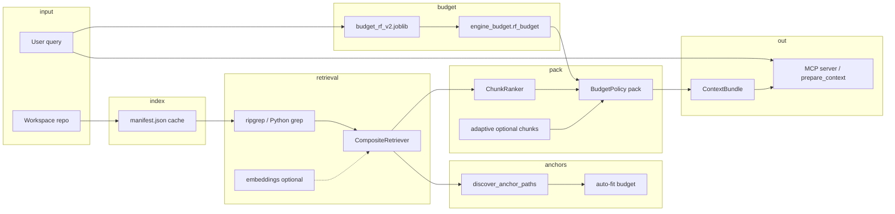

# Context Engineering MCP

A local [Model Context Protocol](https://modelcontextprotocol.io) server that returns **query-matched, token-budgeted context packs** instead of whole files.

## Pipeline



1. **Index** — cached `.context-eng/manifest.json` avoids full-tree scans each query.
2. **Retrieve** — ripgrep when available (Python scan fallback); optional embeddings merge semantic hits.
3. **Discover anchors** — infer must-include files from query + repo; auto-fit raises the budget bucket if anchors won't fit.
4. **Budget** — RF model (`ml/models/budget_rf_v2.joblib`) picks a token ceiling.
5. **Pack** — rank chunks, apply adaptive optional-chunk cap, greedy pack under ceiling.
6. **Output** — `ContextBundle` via `prepare_context` / `/context`.

## Quick start

```powershell
.\scripts\install.ps1
```

Restart Cursor, then in any project:

```
/context how does auth middleware validate tokens?
```

## Requirements

- Python 3.11+
- **ripgrep** recommended (pure-Python grep fallback otherwise)
- `tiktoken` optional for exact token counts (chars/4 heuristic otherwise)

## Setup

```powershell
python -m venv .venv
.venv\Scripts\Activate.ps1
pip install -e ".[dev]"
```

Optional extras:

```powershell
pip install -e ".[tokens]"      # accurate token counts
pip install -e ".[embeddings]"    # semantic retriever (off by default)
```

Add to `~/.cursor/mcp.json`:

```json
{
  "mcpServers": {
    "context-eng": {
      "command": "C:/path/to/context-eng-project/.venv/Scripts/python.exe",
      "args": ["-m", "context_eng.server"]
    }
  }
}
```

## Tools

| Tool / command | Purpose |
|----------------|---------|
| **`/context <query>`** | Analyze + bundle; inject formatted context into chat. |
| **`prepare_context(query, ...)`** | Same as `/context` for agents. |
| `expand_context(bundle_id, ...)` | Add more context when the initial bundle is insufficient. |
| `estimate_tokens(...)` | Token count for text or a built bundle. |

## Configuration

Optional `context-eng.toml` at the workspace root:

```toml
[context_eng]
default_max_tokens = 8000
grep_context_lines = 8
max_grep_candidates = 50
min_chunk_score = 0.15
max_optional_chunks_upper = 4
max_inferred_anchor_files = 3
manifest_auto_build = true
enable_embedding_retriever = false
embedding_model_name = "all-MiniLM-L6-v2"
ignore_globs = [".git", "node_modules", "dist", "__pycache__"]
```

Budget resolution: explicit `max_tokens` on the tool call → RF model → `default_max_tokens` snapped to the nearest bucket.

## Tests

```powershell
pytest
```

## Project layout

```
src/context_eng/
  server.py           # MCP tools (prepare_context, expand_context, …)
  engine.py           # orchestration pipeline
  index/              # manifest.json cache
  retrieval/          # grep, optional embeddings, CompositeRetriever
  anchors/            # discover_anchor_paths, auto-fit budget
  ml/                 # RF budget model (engine_budget, features)
  ranking/            # ChunkRanker
  packing/            # adaptive optional-chunk cap
  budget/             # BudgetPolicy pack
  intent/             # query analysis (RF features)
  tokens/             # token estimator
  formatting.py       # formatted_context for agents
ml/models/            # budget_rf_v2.joblib (trained artifact)
tests/                # unit tests
```
