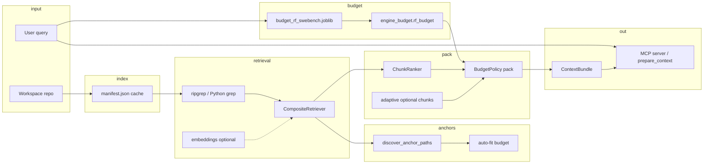

# Context Engineering MCP

Open-source [Model Context Protocol](https://modelcontextprotocol.io) server that **cuts LLM token spend** by returning query-matched, token-budgeted context packs instead of whole files.

A packaged Random Forest (`budget_rf_swebench.joblib`), trained on [SWE-bench Lite](https://www.swebench.com/) oracle/BM25 labels, picks the token ceiling for each query.

**License:** MIT — clone it, run it locally, no cloud required.

## Pipeline


```mermaid
flowchart LR
    subgraph input
      Q[User query]
      WS[Workspace repo]
    end
    subgraph index
      M[manifest.json cache]
    end
    subgraph retrieval
      RG[ripgrep / Python grep]
      EM[embeddings optional]
      CR[CompositeRetriever]
    end
    subgraph anchors
      DI[discover_anchor_paths]
      AF[auto-fit budget]
    end
    subgraph budget
      RF[budget_rf_swebench.joblib]
      EB[engine_budget.rf_budget]
    end
    subgraph pack
      RK[ChunkRanker]
      BP[BudgetPolicy pack]
      AD[adaptive optional chunks]
    end
    subgraph out
      B[ContextBundle]
      MCP[MCP server / prepare_context]
    end
    Q --> MCP
    WS --> M
    M --> RG
    RG --> CR
    EM -.-> CR
    CR --> DI
    Q --> RF
    RF --> EB
    DI --> AF
    EB --> BP
    CR --> RK
    RK --> BP
    AD --> BP
    BP --> B
    B --> MCP
```

1. **Index** — cached `.context-eng/manifest.json` avoids full-tree scans each query.
2. **Retrieve** — ripgrep when available (Python scan fallback); optional embeddings merge semantic hits.
3. **Discover anchors** — infer must-include files from query + repo; auto-fit raises the budget bucket if anchors won't fit.
4. **Budget** — SWE-bench Lite RF picks a token ceiling (explicit `max_tokens` is snapped to a bucket, max 15k).
5. **Pack** — rank chunks, apply adaptive optional-chunk cap, greedy pack under ceiling.
6. **Output** — `ContextBundle` via `prepare_context` / `/context`.

## Quick start

Python 3.11+ (ripgrep recommended; `tiktoken` optional).

**Linux / macOS**

```bash
git clone https://github.com/aidandaniel/context-eng-project.git
cd context-eng-project
chmod +x scripts/install.sh
./scripts/install.sh
```

**Windows (PowerShell)**

```powershell
git clone https://github.com/aidandaniel/context-eng-project.git
cd context-eng-project
.\scripts\install.ps1
```

Restart Cursor, then:

```
/context how does auth middleware validate tokens?
```

The install scripts create `.venv`, `pip install -e ".[dev,tokens]"`, copy the `/context` command, and merge `context-eng` into `~/.cursor/mcp.json` without removing other servers.

Or install the package from GitHub without a full clone:

```bash
pip install "git+https://github.com/aidandaniel/context-eng-project.git"
```

Then register `python -m context_eng.server` in `~/.cursor/mcp.json` (see Manual setup).

## Manual setup

```bash
python3 -m venv .venv
# Windows: .venv\Scripts\Activate.ps1
source .venv/bin/activate
pip install -e ".[dev,tokens]"
```

Optional extras:

```bash
pip install -e ".[tokens]"       # accurate token counts
pip install -e ".[embeddings]"   # local semantic retriever (off by default)
```

Add to `~/.cursor/mcp.json` (use your venv’s `python`):

```json
{
  "mcpServers": {
    "context-eng": {
      "command": "/absolute/path/to/context-eng-project/.venv/bin/python",
      "args": ["-m", "context_eng.server"]
    }
  }
}
```

On Windows the command is `.venv\Scripts\python.exe`.

By default the server may only index the process working directory. To allow additional roots (multi-project):

```bash
export CONTEXT_ENG_ALLOWED_ROOTS="/home/you/src:/home/you/work"
```

Windows: `;`-separated paths in `CONTEXT_ENG_ALLOWED_ROOTS`.

## Tools

| Tool / command | Purpose |
|----------------|---------|
| **`/context <query>`** | Analyze + bundle; inject formatted context into chat. |
| **`prepare_context(query, ...)`** | Same as `/context` for agents. |
| `expand_context(bundle_id, ...)` | Add more context when the initial bundle is insufficient (capped). |
| `estimate_tokens(...)` | Token count for text or a built bundle. |
| `mcp_health` | Version, default RF model, process liveness. |

## Configuration

Optional `context-eng.toml` at the workspace root:

```toml
[context_eng]
default_max_tokens = 8000
grep_context_lines = 8
max_grep_candidates = 50
min_chunk_score = 0.15
max_optional_chunks_upper = 4
max_inferred_anchor_files = 3
max_expansions = 3
manifest_auto_build = true
enable_embedding_retriever = false
embedding_model_name = "all-MiniLM-L6-v2"
ignore_globs = [".git", "node_modules", "dist", "__pycache__"]
```

Invalid TOML is reported as `config_error` on tool responses (defaults still apply). Extra `ignore_globs` merge onto the built-in list (`.git`, `.venv`, secret-prone names are never dropped).

Budget resolution: explicit `max_tokens` (snapped to a bucket, 2k–15k) → SWE-bench Lite RF → `default_max_tokens` snapped to the nearest bucket.

## Tests

```bash
pytest -m "not benchmark"
```

## Project layout

```
src/context_eng/
  server.py           # MCP tools (prepare_context, expand_context, …)
  engine.py           # orchestration pipeline
  index/              # manifest.json cache
  retrieval/          # grep, optional embeddings, CompositeRetriever
  anchors/            # discover_anchor_paths, auto-fit budget
  ml/                 # RF budget code + packaged models/*.joblib
  ranking/            # ChunkRanker
  packing/            # adaptive optional-chunk cap
  budget/             # BudgetPolicy pack
  intent/             # query analysis (RF features)
  tokens/             # token estimator
  formatting.py       # formatted_context for agents
tests/                # unit tests
```
