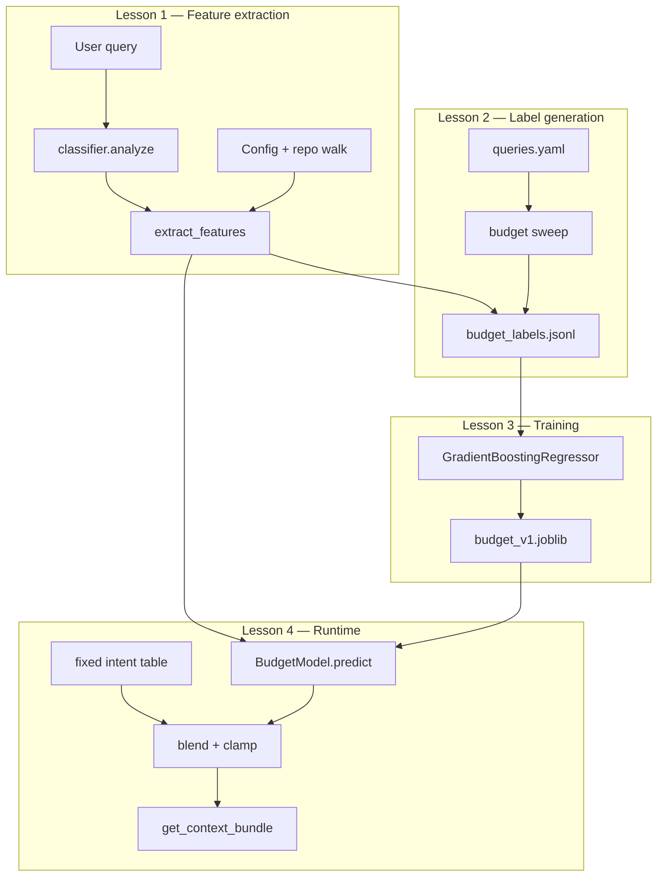
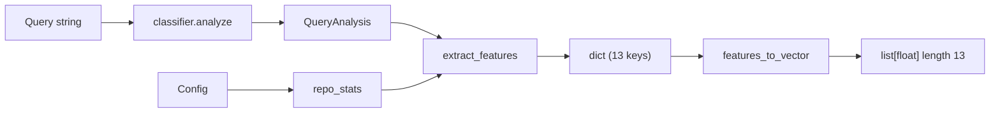
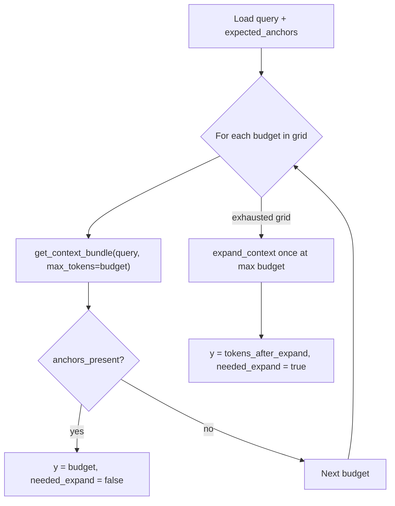

# ML Budget Prediction

**Context Engineering — hands-on tutorial**

You have a working context engine: it classifies queries, assigns a fixed token
budget per intent, and packs a bundle that hits anchor files 100% of the time on
the benchmark. That is a strong baseline — but every query gets the same budget
for its intent. A narrow “explain this one function” request and a broad
“refactor across modules” request both receive 4,000 tokens if the intent is
`explain`. Without a way to **predict query-specific budgets**, you are either
over-fetching on simple tasks or under-fetching on complex ones.

This tutorial walks you through replacing the fixed table with a small ML
regressor — trained on your own benchmark — that still blends safely with the
rule-based anchor so you never ship raw model output.

---

## On this page

1. [Why ML budgets matter](#why-ml-budgets-matter)
2. [The pipeline at a glance](#the-pipeline-at-a-glance)
3. [Prerequisites](#prerequisites)
4. [Lesson 1 — Feature extraction](#lesson-1--feature-extraction)
5. [Lesson 2 — Label generation](#lesson-2--label-generation)
6. [Lesson 3 — Train the model](#lesson-3--train-the-model) *(coming next)*
7. [Lesson 4 — Runtime integration](#lesson-4--runtime-integration) *(coming next)*
8. [Lesson 5 — Evaluate and ship](#lesson-5--evaluate-and-ship) *(coming next)*
9. [Troubleshooting](#troubleshooting)
10. [Glossary](#glossary)

---

## Why ML budgets matter

### Fixed budgets vs. query-specific budgets

**Traditional approach (what you have today):** five intents, five budget
values. `explain` always gets 4,000 tokens. `refactor` always gets 10,000.
Simple, fast, deterministic — and good enough to pass the benchmark gate.

**The gap:** intent is a coarse bucket. Two `explain` queries can need very
different context:

| Query | Fixed budget | Tokens actually needed |
|-------|-------------|------------------------|
| “What does `refreshToken` do in `src/auth/refresh.py`?” | 4,000 | ~600–1,200 |
| “Explain the full auth stack across middleware, tokens, and refresh” | 4,000 | ~3,000–5,000 |

A fixed table treats both the same. An ML budget regressor learns from
**labeled examples** how much ceiling each query shape needs.

### What we are not doing

This is not a large language model. It is a **tiny scikit-learn regressor** (13
numeric features in, one integer budget out) trained on 14 benchmark queries.
Inference takes milliseconds. The safety rule is non-negotiable:

```
final_budget = clamp(
    blend_weight * ml_predicted + (1 - blend_weight) * fixed_anchor,
    intent_min, intent_max,
)
```

You never apply raw ML output. You blend with the fixed table and clamp to
per-intent bounds.

### The ML flywheel for context engineering

A disciplined ML budget pipeline:

- **Establishes a baseline** — fixed intent table + benchmark metrics you already have
- **Generates labels** — sweep budgets on real queries to find minimum viable ceilings
- **Trains a regressor** — features → predicted budget, committed as `budget_v1.joblib`
- **Runs in shadow mode** — log ML vs fixed, apply only when eval passes
- **Guards anchor recall** — the >= 95% gate must still pass after switching to ML

---

## The pipeline at a glance



| Step | You build | Output |
|------|-----------|--------|
| 1 | `src/context_eng/ml/features.py` | Feature dict + vector |
| 2 | `ml/generate_labels.py` | `ml/data/budget_labels.jsonl` |
| 3 | `ml/train_budget.py` | `ml/models/budget_v1.joblib` |
| 4 | `budget_model.py`, `blend.py`, classifier wiring | Shadow / ML modes |
| 5 | `ml/evaluate.py`, benchmark flag | Gate comparison report |

---

## Prerequisites

- Windows PowerShell (commands below assume project root)
- Python 3.10+ with venv at `.venv`
- Step 0 baseline recorded (`benchmarks/BASELINE.md` or `context-eng-benchmark`)

```powershell
cd C:\Users\decke\context-eng-project
.\.venv\Scripts\python.exe -m pip install -e ".[dev]" -q
.\.venv\Scripts\python.exe -m pytest tests/ -q --ignore=tests/test_benchmark.py
```

---

# Lesson 1 — Feature extraction

**Status:** Implemented in this repo.

**Goal:** Turn a query + workspace into a fixed-order numeric vector the ML
model can consume — using the **same** code at label-generation time and at
runtime.

---

## Why feature extraction is its own module

You already extract signals in `classifier.analyze()`:

- `query_tokens`, mentioned files, mentioned symbols
- `has_stack_trace`, `has_error_token`
- intent + confidence

The classifier’s job is **understanding the query**. The feature module’s job is
**packaging for ML**: flatten signals, add repo stats, one-hot encode intent,
enforce column order.

If label generation and runtime used different feature code, the model would
see a different distribution at inference than at training. One module, one
source of truth.

---

## The 13 features

| # | Name | Type | Source |
|---|------|------|--------|
| 1 | `query_tokens` | int | `QuerySignals.query_tokens` |
| 2 | `mentioned_files` | int | count of paths in query |
| 3 | `mentioned_symbols` | int | count of symbols in query |
| 4 | `has_stack_trace` | 0/1 | stack trace regex hit |
| 5 | `has_error_token` | 0/1 | error keyword hit |
| 6 | `intent_confidence` | float | classifier confidence |
| 7 | `repo_file_count` | int | files in workspace (respecting ignores) |
| 8 | `repo_loc_log` | float | `log10(total_lines + 1)` |
| 9–13 | `intent_debug` … `intent_review` | one-hot | exactly one = 1 |

**Design rules:**

- Booleans become `0` or `1`, not Python `True`/`False`
- `intent_confidence` is a float; do not confuse it with `intent_*` one-hot columns
- `FEATURE_NAMES` order is frozen after v1 training

---

## Data flow



`extract_features` does **not** re-parse the query. It reads `QueryAnalysis`
and walks the repo once for stats.

---

## Implementation walkthrough

### File layout

```
src/context_eng/ml/
├── __init__.py          # empty package marker
└── features.py          # all Step 1 logic
tests/
└── test_ml_budget.py    # test_feature_extraction
```

### Sub-step 1 — Constants

```python
INTENT_COLUMNS = [
    "intent_debug", "intent_implement", "intent_explain",
    "intent_refactor", "intent_review",
]

BASE_FEATURE_NAMES = [
    "query_tokens", "mentioned_files", "mentioned_symbols",
    "has_stack_trace", "has_error_token", "intent_confidence",
    "repo_file_count", "repo_loc_log",
]

FEATURE_NAMES = BASE_FEATURE_NAMES + INTENT_COLUMNS
```

### Sub-step 2 — `repo_stats(config)`

Walks the workspace with `iter_files` (same ignore rules as retrieval):

```python
def repo_stats(config: Config) -> tuple[int, float]:
    workspace = Path(config.workspace_root).resolve()
    file_count = 0
    total_lines = 0
    for path in iter_files(workspace, config.ignore_globs):
        file_count += 1
        text = read_text(path)
        total_lines += text.count("\n") + (1 if text else 0)
    return file_count, math.log10(total_lines + 1)
```

`log10(loc + 1)` keeps huge monorepos from dominating the feature space.

### Sub-step 3 — `_intent_one_hot(intent)`

```python
def _intent_one_hot(intent: Intent) -> dict[str, int]:
    active = f"intent_{intent.value}"
    return {col: (1 if col == active else 0) for col in INTENT_COLUMNS}
```

### Sub-step 4 — `extract_features`

```python
def extract_features(query, analysis, config) -> dict[str, float | int]:
    signals = analysis.signals
    file_count, loc_log = repo_stats(config)
    features = {
        "query_tokens": signals.query_tokens,
        "mentioned_files": len(signals.mentioned_files),
        "mentioned_symbols": len(signals.mentioned_symbols),
        "has_stack_trace": int(signals.has_stack_trace),
        "has_error_token": int(signals.has_error_token),
        "intent_confidence": analysis.confidence,
        "repo_file_count": file_count,
        "repo_loc_log": loc_log,
    }
    features.update(_intent_one_hot(analysis.intent))
    return features
```

### Sub-step 5 — `features_to_vector`

```python
def features_to_vector(features) -> tuple[list[float], list[str]]:
    values = [float(features[name]) for name in FEATURE_NAMES]
    return values, list(FEATURE_NAMES)
```

---

## You test — Lesson 1

### Run the unit test

```powershell
.\.venv\Scripts\python.exe -m pytest tests/test_ml_budget.py::test_feature_extraction -q
```

**Expect:** `1 passed`

### Interactive smoke test

```powershell
.\.venv\Scripts\python.exe -c "
from pathlib import Path
from context_eng.config import Config
from context_eng.intent.classifier import analyze
from context_eng.ml.features import extract_features, features_to_vector

cfg = Config(workspace_root=Path('benchmarks/fixture_repo'))
q = 'Fix TypeError in src/auth/refresh.py'
a = analyze(q, cfg)
feats = extract_features(q, a, cfg)
vec, names = features_to_vector(feats)
print('vector length:', len(vec))
print('intent_debug:', feats['intent_debug'])
print('repo_file_count:', feats['repo_file_count'])
print('repo_loc_log:', round(feats['repo_loc_log'], 2))
"
```

**Expect:**

| Check | Value |
|-------|-------|
| `vector length` | 13 |
| `intent_debug` | 1 |
| `repo_file_count` | > 20 |
| `repo_loc_log` | roughly 3.0–5.0 |

### What a good feature dict looks like

```json
{
  "query_tokens": 9,
  "mentioned_files": 1,
  "mentioned_symbols": 0,
  "has_stack_trace": 0,
  "has_error_token": 1,
  "intent_confidence": 0.99,
  "repo_file_count": 28,
  "repo_loc_log": 4.1,
  "intent_debug": 1,
  "intent_implement": 0,
  "intent_explain": 0,
  "intent_refactor": 0,
  "intent_review": 0
}
```

---

## Lesson 1 checkpoint

Before moving on, confirm:

- [ ] `from context_eng.ml.features import extract_features` works
- [ ] `test_feature_extraction` passes
- [ ] One-hot columns sum to exactly 1 (use `INTENT_COLUMNS`, not `startswith("intent_")`)

---

# Lesson 2 — Label generation

**Status:** Not yet implemented in this repo. **Requires Lesson 1.**

**Goal:** For each of the 14 benchmark queries, find the **smallest token
budget** where all `expected_anchors` appear in the bundle **without**
`expand_context`. That number becomes the training label `y`.

---

## Why labels come from a budget sweep

**Traditional ML datasets:** someone hand-labels thousands of rows.

**Your situation:** you have 14 realistic queries in `benchmarks/queries.yaml`,
each with ground-truth anchor files, and a working `ContextEngine` that packs
bundles at any `max_tokens` ceiling.

A **budget sweep** is your golden dataset generator:

1. Try `max_tokens = 2000` → anchors present? No → record and continue
2. Try `max_tokens = 3000` → anchors present? No → continue
3. Try `max_tokens = 4000` → anchors present? **Yes → label `y = 4000`, stop**

You are not guessing budgets. You are **measuring** the minimum ceiling that
still satisfies the anchor recall contract.

---

## The sweep algorithm



**Budget grid (ascending):**

```
2000, 3000, 4000, 5000, 6000, 8000, 10000, 12000, 15000
```

**Anchor check** (same as `benchmarks/run_mcp.py`):

```python
def anchors_present(bundle, expected_anchors: list[str]) -> bool:
    paths = {c.path for c in bundle.chunks}
    for anchor in expected_anchors:
        a = anchor.replace("\\", "/")
        if not any(p == a or p.endswith(a) for p in paths):
            return False
    return True
```

**Critical distinction:**

| Field | Meaning |
|-------|---------|
| `y` | The **budget ceiling** that worked (e.g. 4000) |
| `tokens_used` | Actual tokens in the bundle (often much smaller, e.g. 680) |

The model learns to predict the ceiling, not the fill level.

---

## What you will build

```
ml/
├── __init__.py
├── generate_labels.py       # sweep + CLI
└── data/
    └── budget_labels.jsonl  # created when you RUN the CLI
```

**Modify** `pyproject.toml`:

```toml
[tool.setuptools.packages.find]
include = ["context_eng*", "benchmarks*", "ml*"]

[project.scripts]
context-eng-ml-labels = "ml.generate_labels:main"
```

---

## Implementation walkthrough

### Sub-step 1 — Scaffold `ml/generate_labels.py`

```python
_REPO_ROOT = Path(__file__).resolve().parent.parent
_DEFAULT_WORKSPACE = _REPO_ROOT / "benchmarks" / "fixture_repo"
_DEFAULT_QUERIES = _REPO_ROOT / "benchmarks" / "queries.yaml"
_DEFAULT_OUTPUT = _REPO_ROOT / "ml" / "data" / "budget_labels.jsonl"

BUDGET_GRID = [2000, 3000, 4000, 5000, 6000, 8000, 10000, 12000, 15000]
```

### Sub-step 2 — `sweep_one_query`

```python
def sweep_one_query(query, expected_anchors, engine: ContextEngine) -> dict:
    sweep_trace = []
    for budget in BUDGET_GRID:
        bundle = engine.get_context_bundle(query, max_tokens=budget)
        tokens_used = sum(c.tokens for c in bundle.chunks)
        ok = anchors_present(bundle, expected_anchors)
        sweep_trace.append({
            "budget": budget,
            "anchors_ok": ok,
            "tokens_used": tokens_used,
            "files": sorted({c.path for c in bundle.chunks}),
        })
        if ok:
            return {"y": budget, "needed_expand": False, "sweep_trace": sweep_trace}

    # Fallback: expand at max budget
    last = engine.get_context_bundle(query, max_tokens=BUDGET_GRID[-1])
    expanded = engine.expand_context(last.bundle_id)
    y = sum(c.tokens for c in expanded.chunks)
    return {"y": y, "needed_expand": True, "sweep_trace": sweep_trace}
```

Pass `max_tokens=budget` explicitly. The engine uses it here:

```python
budget_limit = max_tokens or analysis.budget.recommended
```

### Sub-step 3 — `label_all`

For each entry in `queries.yaml`:

```python
analysis = analyze(query, config)
features = extract_features(query, analysis, config)  # Lesson 1
sweep = sweep_one_query(query, expected_anchors, engine)
```

Merge into one JSONL row per query.

### Sub-step 4 — Output row schema

```json
{
  "query_id": "explain_refresh_flow",
  "query": "How does the token refresh flow work in src/auth/refresh.py?",
  "intent": "explain",
  "y": 4000,
  "needed_expand": false,
  "anchor_budget": 4000,
  "features": {
    "query_tokens": 14,
    "mentioned_files": 1,
    "repo_file_count": 28,
    "intent_explain": 1,
    "intent_debug": 0
  },
  "sweep_trace": [
    {"budget": 2000, "anchors_ok": false, "tokens_used": 450},
    {"budget": 3000, "anchors_ok": false, "tokens_used": 520},
    {"budget": 4000, "anchors_ok": true,  "tokens_used": 680}
  ]
}
```

| Field | Purpose |
|-------|---------|
| `y` | Training target for the regressor |
| `anchor_budget` | Fixed table value (`analysis.budget.recommended`) for comparison |
| `features` | Lesson 1 output — must match runtime exactly |
| `sweep_trace` | Debug trail; validate `y` = first `anchors_ok: true` budget |
| `needed_expand` | Flag queries that required progressive disclosure |

---

## You test — Lesson 2

### Install and verify CLI

```powershell
.\.venv\Scripts\python.exe -m pip install -e ".[dev]" -q
context-eng-ml-labels --help
```

**Expect:** usage with `--workspace`, `--queries`, `--output`

### Run label generation

```powershell
context-eng-ml-labels `
  --workspace benchmarks/fixture_repo `
  --queries benchmarks/queries.yaml `
  --output ml/data/budget_labels.jsonl
```

**Runtime:** ~30–90 seconds (14 queries × up to 9 budget attempts)

### Inspect output

```powershell
# Row count — must be 14
(Get-Content ml/data/budget_labels.jsonl).Count

# Pretty-print first row
.\.venv\Scripts\python.exe -c "
import json
with open('ml/data/budget_labels.jsonl') as f:
    print(json.dumps(json.loads(f.readline()), indent=2))
"
```

### Manual validation — one query

```powershell
.\.venv\Scripts\python.exe -c "
import json
TARGET = 'explain_refresh_flow'
with open('ml/data/budget_labels.jsonl') as f:
    for line in f:
        r = json.loads(line)
        if r['query_id'] == TARGET:
            print('y:', r['y'])
            for s in r['sweep_trace']:
                print(f\"  budget={s['budget']} ok={s['anchors_ok']} tokens={s['tokens_used']}\")
"
```

**What to look for:**

- `y` equals the **first** budget where `anchors_ok=True`
- Explain queries often have **lower** `y` than the fixed 4,000 table
- Refactor queries often have **higher** `y` than explain queries

**Red flags:**

| Symptom | Likely cause |
|---------|--------------|
| All 14 rows have identical `y` | Sweep not passing `max_tokens` |
| Every row has `needed_expand=true` | Anchor check or retrieval broken |
| Missing `features` keys | Lesson 1 not wired in |
| `'context-eng-ml-labels' not recognized` | Missing `pyproject.toml` script or no reinstall |

---

## Lesson 2 checkpoint

Before training (Lesson 3):

- [ ] `ml/data/budget_labels.jsonl` exists with 14 rows
- [ ] Every row has a complete `features` dict (13 keys)
- [ ] At least a few rows have different `y` values
- [ ] `sweep_trace` is consistent with `y`

---

# Lesson 3 — Train the model

**Status:** Coming next. **Requires Lesson 2** (`budget_labels.jsonl`).

**Goal:** Fit a `GradientBoostingRegressor` on features → `y`, save
`ml/models/budget_v1.joblib` for CI and runtime.

**Sketch:**

```powershell
.\.venv\Scripts\python.exe -m pip install -e ".[ml]" -q
context-eng-ml-train --labels ml/data/budget_labels.jsonl --output ml/models/budget_v1.joblib
```

Train on p85 quantile of successful budgets to avoid under-fetching. Commit the
small joblib file so CI does not need to retrain.

---

# Lesson 4 — Runtime integration

**Status:** Coming next. **Requires Lesson 3.**

**Goal:** Wire `BudgetModel` into `classifier.analyze()` with three modes:

| Mode | Behavior |
|------|----------|
| `fixed` | Current behavior (default) |
| `shadow` | Run ML, log both budgets, apply fixed |
| `ml` | Run ML, blend + clamp, apply result |

Files: `src/context_eng/ml/budget_model.py`, `blend.py`, config additions.

---

# Lesson 5 — Evaluate and ship

**Status:** Coming next.

**Goal:** Compare fixed vs ML on the benchmark gate:

- Median token reduction >= 30%
- Anchor recall >= 95%
- p90 latency < 3000 ms

```powershell
context-eng-benchmark --budget-mode ml
python -m ml.evaluate
```

Only switch `budget_mode` to `"ml"` in production config after the gate passes.

---

## Troubleshooting

| Error | Fix |
|-------|-----|
| `No module named 'context_eng.ml'` | Lesson 1 not built; check `src/context_eng/ml/features.py` |
| `No module named 'ml'` | Add `ml*` to `pyproject.toml` include; reinstall |
| `test_feature_extraction` fails on one-hot sum | Use `INTENT_COLUMNS`, not `startswith("intent_")` (catches `intent_confidence`) |
| `repo_file_count` is 0 | Wrong `--workspace`; use `benchmarks/fixture_repo` |
| All labels identical | `get_context_bundle` not receiving `max_tokens` per sweep step |

---

## Glossary

| Term | Definition |
|------|------------|
| **Anchor** | A file that must appear in the bundle (`expected_anchors` in queries.yaml) |
| **Budget ceiling** | `max_tokens` passed to `get_context_bundle` — not the tokens actually used |
| **Label `y`** | Minimum budget ceiling where anchors succeed without expand |
| **One-hot intent** | Five columns; exactly one is 1 for the classified intent |
| **Shadow mode** | Run ML for logging but apply the fixed table budget |
| **Blend** | `0.7 * ml + 0.3 * fixed` (default), then clamp to intent min/max |
| **Sweep trace** | Per-budget debug log stored in each JSONL row |

---

## What is next

1. Complete **Lesson 2** if you have not yet — run `context-eng-ml-labels`
2. Implement **Lesson 3** — train and smoke-test `BudgetModel.predict()`
3. Run **shadow mode** before flipping to ML in production

When you are ready to implement Lesson 2 in the repo, switch to Agent mode and
say **"implement Step 2"**.
